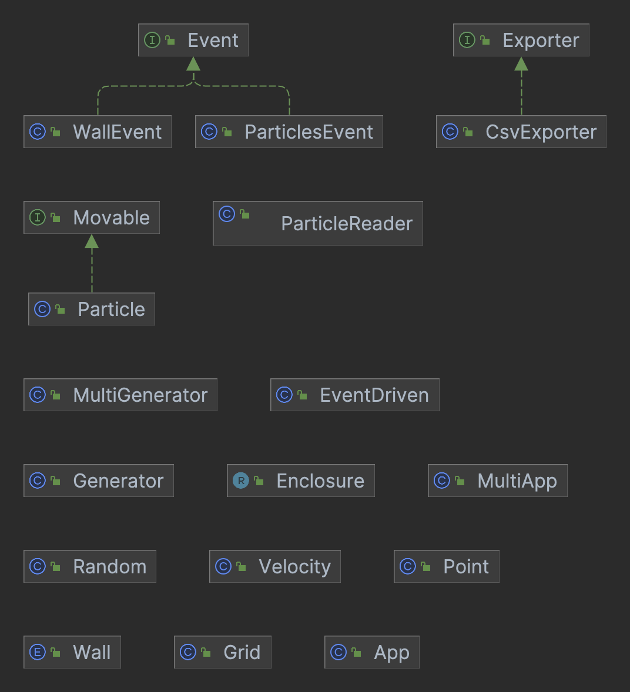

# SS TP3: Difusión de un gas 2D

Implementación Trabajo Práctico Número 3: Difusión de un gas 2D para la materia 72.25 - Simulación de Sistemas - Segundo Cuatrimestre 2022.

# Autores

* [Julián Francisco **Arce Doncella**](https://github.com/JuArce)
* [Roberto José **Catalán**](https://github.com/rcatalan98)
* [Gian Luca **Pecile**](https://github.com/glpecile)

# Dependencias

* [Java 17](https://www.oracle.com/java/technologies/javase/jdk17-archive-downloads.html)

# Diagrama UML



# Compilación

Para compilar el proyecto, se debe ejecutar el siguiente comando en la raíz del proyecto:

```bash
maven clean install
```

# Ejecución

## [Generator](src/main/java/ar/edu/itba/ss/Generator.java)

Generador de archivos estáticos y dinámicos para partículas. Asegurarse de tener el directorio `src/main/resources/input` previamente creado.

Parámetros:

* `n`: cantidad de partículas.
* `Lx`: largo del sistema en x (0.12).
* `Ly`: largo del sistema en y (0.09).
* `k`: ancho de la ranura.
* `staticNFile.csv`: nombre del archivo estático de salida.
* `dynamicNFile.csv` nombre del archivo dinámico de salida.

## [MultiGenerator](src/main/java/ar/edu/itba/ss/MultiGenerator.java)

Genera múltiples parámetros para ser usados en app. Asegurarse de tener el directorio `src/main/resources/input/parameters` creado previamente.

Variables:

* `final List<Integer> N = Arrays.asList(<N>);`: cantidad de partículas.
* `final List<Double> slot = Arrays.asList(<slot>);`: largo de ranura (0.01).

## [App](src/main/java/ar/edu/itba/ss/App.java)

Aplicación principal. Asegurarse de tener el directorio `src/main/resources/output` creado previamente.

Parámetros:

* `pathToStaticNFile.csv`: nombre del path al archivo estático de entrada.
* `pathToDynamicNFile.csv` nombre del path al archivo dinámico de entrada.
* `outputFilename`: nombre del archivo de salida, si no es incluido toma el nombre `output.csv` por defecto.
* `fpFilename`: nombre del archivo de salida de la función de partición, si no es incluido toma el nombre `output_fp.csv` por defecto.
* `ovitoFilename`: nombre del archivo de salida para ovito, si no es incluido toma el nombre `output_ovito.csv` por defecto.

## [MultiApp](src/main/java/ar/edu/itba/ss/MultiApp.java)

Aplicación principal para creación de múltiples archivos de salida. Asegurarse de tener los directorios `src/main/resources/output/ovito`, `src/main/resources/output/fp` y `src/main/resources/output/paramters` creados previamente.

Variables:
* `final List<Integer> N = Arrays.asList(<N>);`: cantidad de partículas.
* `final List<Double> slot = Arrays.asList(<slot>);`: largo de ranura (0.01).